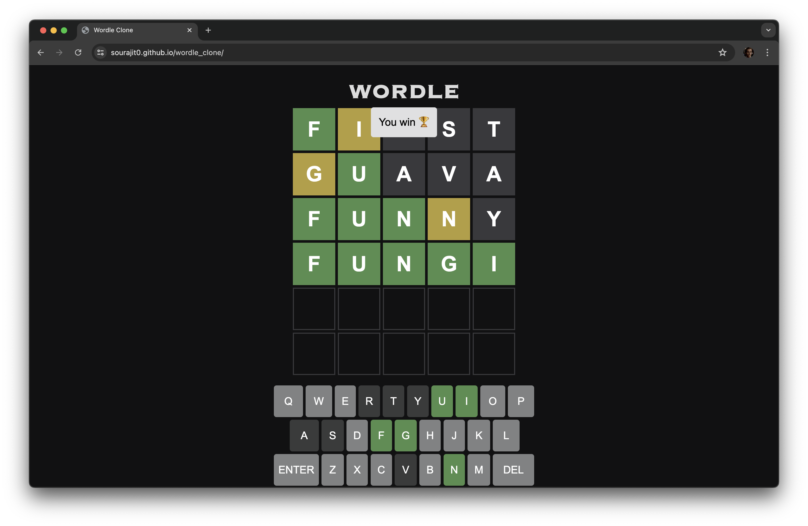

# Wordle Clone

This is a simple clone of the popular game Wordle, built for educational purposes. It allows players to guess a hidden word within a limited number of attempts. This project was created as a first project to learn web development.

## Features

- **Gameplay**: Players can guess the hidden word within six attempts.
- **Feedback**: Provides feedback on the correctness of the guess.
- **Responsive Design**: The game is responsive and can be played on different devices.
- **Simple Interface**: Clean and intuitive user interface.

## Technologies Used

- **HTML**: For the structure and layout of the web page.
- **CSS**: For styling and making the game visually appealing.
- **JavaScript**: For implementing the game logic and interactivity.
- **GitHub Pages**: Used for hosting the game.
# Wordle Game Rules

Welcome to Wordle! Here's how to play:

## Objective

Guess the secret five-letter word within six attempts.

## Gameplay

1. **Starting the Game:**
    - Visit the [Wordle](https://sourajit0.github.io/wordle_clone/) website to start the game.
      
2. **Guessing Words:**
    - Enter a five-letter word guess into the input field.
    - Submit your guess by pressing the enter key or clicking the submit button.

3. **Feedback:**
    - Each letter in your guess will be colored:
        - Green: Correct letter in the correct position.
        - Yellow: Correct letter in the wrong position.
        - Gray: Letter not in the word.
        
4. **Attempts:**
    - You have six attempts to guess the word correctly.

5. **Winning/Losing:**
    - Win: Guess the word correctly within six attempts.
    - Lose: Exceed six attempts without guessing the word correctly.

## Tips and Strategies

- Start with common letters or words to narrow down possibilities.
- Pay attention to the feedback and adjust your guesses accordingly.
- Use logic and deduction to eliminate unlikely words.

## Have Fun!

Now that you know the rules, it's time to start playing Wordle! Enjoy the challenge and have fun guessing words. If you have any questions or encounter any issues, feel free to reach out to us.

Happy Wordling!

## Getting Started

To get a local copy up and running, follow these simple steps:

1. Clone the repository:
   ```sh
   git clone https://github.com/sourajit0/wordle-clone.git
## Live Demo

Check out the live demo of the app [here](https://sourajit0.github.io/wordle_clone/).

## Screenshots


